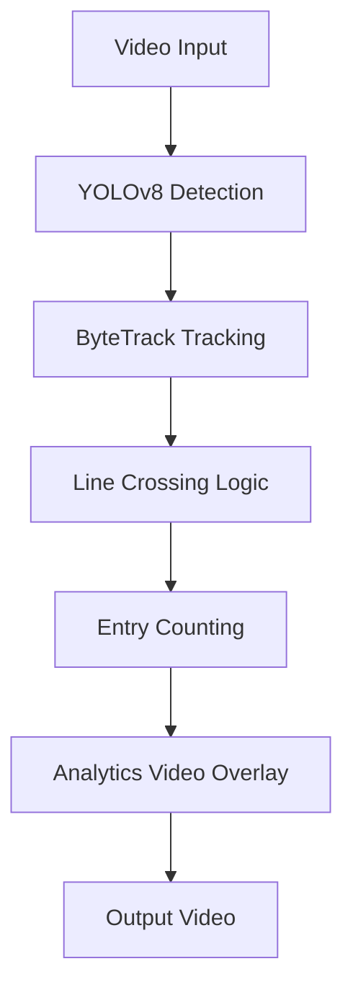

# Track-Site

A simple computer vision project that detects, tracks and counts people crossing a virtual line in a video stream.

<p align="center">
  
</p>

## Process Pipeline



## Features

- Person detection using YOLOv8
- Multi-object tracking with ByteTrack
- Line crossing detection
- Entry counting
- CCTV-style video overlay
- Corner bounding boxes
- Transparent counting line
- Camera header (camera ID, timestamp, FPS)


## Example Output

Example frame from the processed video:


The overlay includes:

- object ID
- bounding box
- counting line
- entry counter
- camera information

## Setup
clone this repository and install the required dependencies:

```bash
git clone https://github.com/anktw/track-site.git
cd track-site
```

Install the required dependencies after setting up a virtual environment:

```bash
python -m venv venv
source venv/bin/activate  # On Windows: venv\Scripts\activate
pip install -r requirements.txt
```

Run the main script with the following command:

```bash
python track_site.py
```
