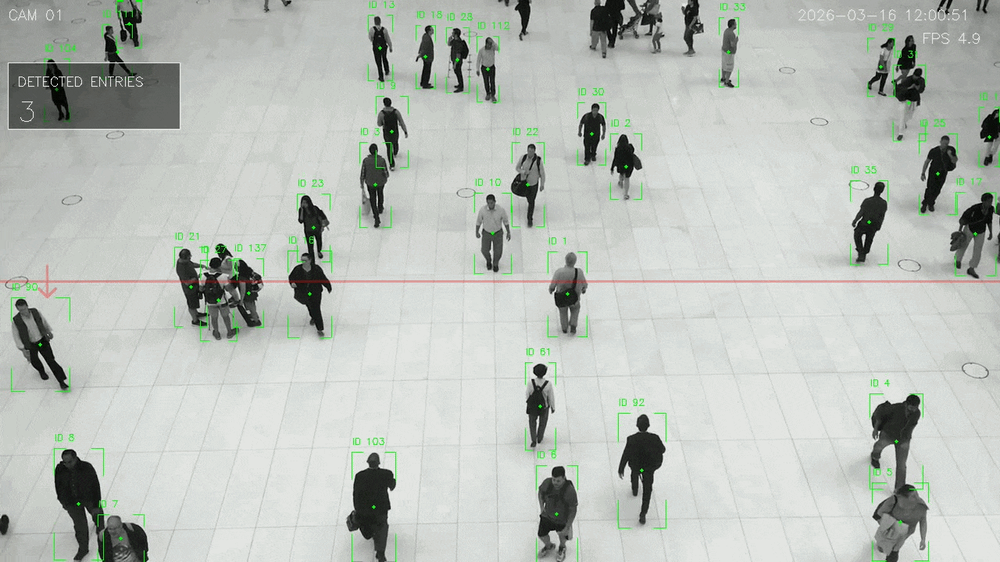
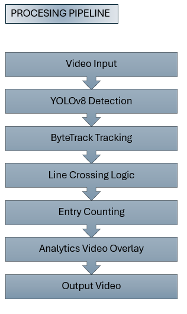
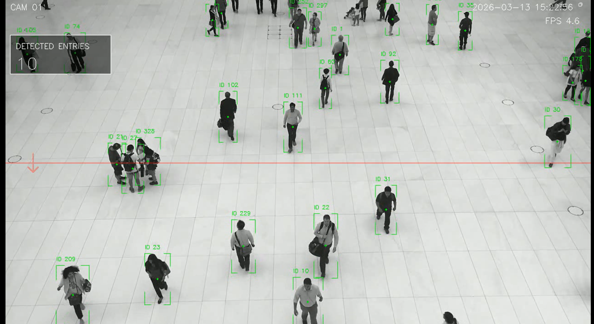

# YOLOv8 Line Crossing People Counter

A simple computer vision project that detects, tracks and counts people crossing a virtual line in a video stream.
The system uses YOLOv8 for object detection, ByteTrack for tracking and a custom line-crossing logic to count entries.

## Demo

  

## Process Pipeline

## Features

- Person detection using YOLOv8
- Multi-object tracking with ByteTrack
- Line crossing detection
- Entry counting
- CCTV-style video overlay
- Corner bounding boxes
- Transparent counting line
- Camera header (camera ID, timestamp, FPS)

## Example Output

Example frame from the processed video:

The overlay includes:

- object ID
- bounding box
- counting line
- entry counter
- camera information

## Technologies Used

    - YOLOv8 (Ultralytics)
    - OpenCV
    - PyTorch
    - ByteTrack
